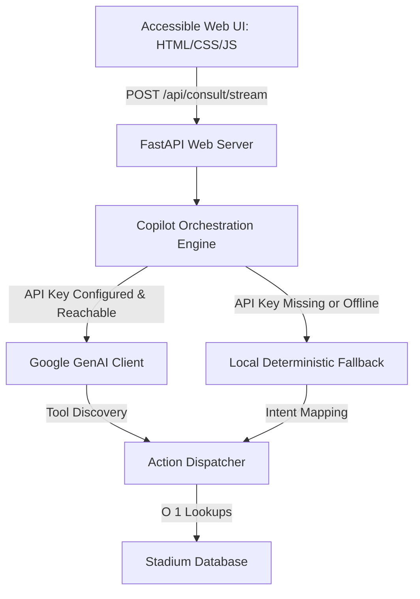

# AssistArena — Accessible Spectator Copilot for FIFA World Cup 2026

**Challenge 4 — Smart Stadiums & Tournament Operations**

AssistArena is an accessibility-first virtual intelligence copilot designed to support spectators and optimize stadium operations during the FIFA World Cup 2026 across the USA, Canada, and Mexico. By combining user accessibility profiles (physical mobility, low-vision, hearing assistance, and calm/sensory support) with simulated real-time operational feeds, AssistArena delivers customized navigation plans, gate routing recommendations, and site assistance details.

The copilot operates under two separate execution engines:
* **Live Mode:** Powered by the Google GenAI SDK and the `gemini-2.5-flash` model, using a manual loop to orchestrate function-calling sequences. This allows the model to inspect stadium configurations and live status reports dynamically before compiling a final, grounded response.
* **Offline Mode:** A local, zero-network fallback engine that uses regular expression intent classifiers and predefined templates. This engine runs with **zero network dependencies and zero API key configurations**, enabling complete evaluation of all features in offline environments.

---

## 1. Selected Focus Vertical: Accessibility, Multilingual Support & Real-Time Decision Making

AssistArena targets **Accessibility** as its primary vertical, integrating **Multilingual Assistance** and **Real-Time Operational Support** as core supporting capabilities. 

* **Rubric Alignment:** Accessibility is a core scoring criterion. AssistArena addresses this directly by providing tailored assistance plans based on spectator profiles.
* **Multilingual Expansion:** The three host nations naturally call for multilingual support. AssistArena offers native localization across English, Spanish, French, and Arabic (complete with Right-to-Left formatting layout support) for both the user interface and the assistant responses.
* **Real-Time Decisions:** By integrating simulated real-time operational status feeds (monitoring gate congestion levels and lift maintenance incidents), the app dynamically adjusts navigation routing to guide users away from crowded gates or inactive elevators.
* **Target Personas:** Spectators requiring physical assistance (step-free routes, lift availability), visual assistance (audio descriptions, tactile maps), auditory assistance (assistive listening loops, visual cues), or sensory relief (calm rooms, quiet paths), as well as their caretakers.

---

## 2. System Architecture & Decision Flow

AssistArena is designed as a stateless application. User query parameters, spectator profiles, and historical chat structures round-trip with every request.



### Context-Driven Decision Pipeline
The system integrates user profile data and real-time operational variables to customize routes:
1. **Live Feeds:** The `query_realtime_status` tool simulates active gate traffic and facility outages (e.g. lift maintenance) for the match hour.
2. **User Profile Evaluation:** The routing engine evaluates the user's needs:
   * If `physical` access is requested, the system filters out gates experiencing elevator outages.
   * The remaining accessible gates are sorted by traffic level to route the spectator through the **calmest available entrance**.
3. **Step Compilation:** The visit itinerary builder inserts custom navigation hints specific to the user's needs (e.g., quiet paths for `calm`, audio description stands for `visual`, digital check-in signage for `auditory`).

---

## 3. Directory and Codebase Structure

The project separates backend and frontend layers:

* [`backend/server.py`](file:///c:/Github/Smart-Stadiums-Tournament-Operations/clone/backend/server.py)
  * Manages the FastAPI application lifecycle and startup configurations.
  * Registers routers, configures static asset directories, and injects secure HTTP headers into all outgoing responses.
  * Handles NDJSON streaming endpoints for real-time text generation.
* [`backend/models.py`](file:///c:/Github/Smart-Stadiums-Tournament-Operations/clone/backend/models.py)
  * Declares Pydantic validation schemas (`ConsultProfile`, `ConversationTurn`, `ConsultRequest`).
  * Enforces length constraints (queries limited to 2,000 characters, history capped at 20 turns, and needs lists limited to 4 items) and rejects unknown inputs.
* [`backend/database.py`](file:///c:/Github/Smart-Stadiums-Tournament-Operations/clone/backend/database.py)
  * Parses the tournament database on startup.
  * Constructs an in-memory dictionary index (`_STADIUMS_BY_ID`) to enable $O(1)$ constant-time stadium queries.
* [`backend/actions.py`](file:///c:/Github/Smart-Stadiums-Tournament-Operations/clone/backend/actions.py)
  * Contains the business logic for the assistant's tools.
  * Handles simulated traffic generation using a seeded PRNG, elevator outage simulations, calm entrance calculations, and needs-based arrival guide compilation.
* [`backend/copilot.py`](file:///c:/Github/Smart-Stadiums-Tournament-Operations/clone/backend/copilot.py)
  * Orchestrates interactions with the Google GenAI SDK.
  * Configures function declarations (`fetch_stadium_info`, `find_support_services`, `query_realtime_status`, `compile_arrival_guide`), executes the tool-calling loop, and routes requests to the offline fallback engine during network or credential failures.
* [`backend/fallback.py`](file:///c:/Github/Smart-Stadiums-Tournament-Operations/clone/backend/fallback.py)
  * Runs the local deterministic matching engine.
  * Processes inputs using compiled regex templates and returns localized answers (English, Spanish, French, Arabic).
* [`backend/limiter.py`](file:///c:/Github/Smart-Stadiums-Tournament-Operations/clone/backend/limiter.py)
  * Implements rate-limiting token buckets.
  * Supports in-memory tracking with automatic registry pruning, as well as Redis-backed distributed rate limiting via atomic Lua script execution.
* [`frontend/index.html`](file:///c:/Github/Smart-Stadiums-Tournament-Operations/clone/frontend/index.html)
  * Main HTML interface structure. Built with semantic elements (`header`, `main`, `footer`), high-contrast colors, and complete keyboard navigation accessibility landmarks.
* [`frontend/main.js`](file:///c:/Github/Smart-Stadiums-Tournament-Operations/clone/frontend/main.js)
  * Client-side JavaScript controller. Manages UI event listeners, local storage configurations, onboarding overlays, focus traps, and parses NDJSON stream frames.
* [`frontend/theme.css`](file:///c:/Github/Smart-Stadiums-Tournament-Operations/clone/frontend/theme.css): 
  * Accessibility-first stylesheet. Maps HSL variable definitions to opaque dark/light background states, increases interactive target sizes to $\ge$ 48px, and supports Windows High Contrast mode (`forced-colors`).

---

## 4. Setup and Installation

### Prerequisites
* Python 3.12 or higher.

### Step-by-Step Execution
```bash
# 1. Initialize and activate a virtual environment
python -m venv .venv
source .venv/bin/activate             # On Windows use: .venv\Scripts\activate

# 2. Install required application packages
pip install -r requirements.txt

# 3. (Optional) Configure Gemini API access for Live Mode
# Copy the example env file and add your Google AI Studio API key
cp .env.example .env
# Edit .env or export the key directly in your terminal:
export GEMINI_API_KEY="your_api_key_here"

# 4. Start the FastAPI server locally
python -m uvicorn backend.server:app --reload
# Access the web UI at http://127.0.0.1:8000
```

*Note: If no API key is supplied, the app automatically starts in **Offline Mode** with local templates, allowing complete functional testing without credentials.*

---

## 5. Security & Risk Controls

* **Zero Credentials Exposure:** API keys are read from environment variables; `.env` is git-ignored, and no keys are written to telemetry, logs, or endpoint payloads.
* **Strict Security Headers:** All API and static HTTP responses carry strict browser protections:
  * `Content-Security-Policy: default-src 'self'; script-src 'self'; style-src 'self' 'unsafe-inline'; connect-src 'self'; img-src 'self' data:; frame-ancestors 'none';`
  * `X-Frame-Options: DENY` (Anti-Clickjacking)
  * `X-Content-Type-Options: nosniff` (Anti-MIME Sniffing)
  * `Referrer-Policy: no-referrer`
* **XSS-Safe DOM Manipulation:** The frontend does not make use of `innerHTML` or `insertAdjacentHTML`. Dynamic content is safely injected using `textContent` and `createTextNode`. No inline scripts or event handlers are present.
* **Input Boundaries & Rate Limiting:** 
  * Pydantic schemas enforce limits (query sizes of 1-2000 chars, $\le$ 20 chat history turns, and rejection of all unrecognized fields).
  * Requests are throttled using an IP-bucket rate limiter. Setting `REDIS_URL` connects the app to a shared Redis instance running an atomic Lua token bucket, which gracefully falls back to the local in-memory token-bucket limiter if connection issues arise.
* **Prompt Injection Defense:** System instructions specify that user messages are non-trusted requests. The assistant is constrained to answer facts sourced exclusively from the return values of our official tools.

---

## 6. WCAG 2.2 AAA Accessibility Implementations

AssistArena follows the WCAG 2.2 AAA (Triple-A) accessibility specifications:
* **Screen Reader Integration:** The chat log uses `role="log"` and `aria-live="polite"`. The streaming text tokens are hidden via `aria-hidden="true"` while the system is `aria-busy="true"`, ensuring the completed sentence is read clearly exactly once.
* **Keyboard Navigation & Focus Control:** Active onboarding steps utilize focus traps. Headings are marked with custom IDs and are programmatically focused on modal step transitions. Focus is returned to the compose input field after a message is sent.
* **WCAG Contrast & Themes:** Solid background colors are mapped to CSS variables to ensure text elements achieve contrast ratios $\ge$ 7:1 (e.g. lavender assistant labels achieve 10.5:1 contrast). Supports light mode, dark mode, and Windows High Contrast mode (`forced-colors`).
* **Multilingual Layouts:** Full support for Right-To-Left (RTL) Arabic, shifting both the message log and the composer input direction dynamically.

---

## 7. Performance & Resource Efficiency Highlights

* **$O(1)$ Database Indexing:** During module initialization, the static JSON database is loaded once and mapped to a lookup dictionary, replacing linear iteration loops with instant constant-time lookups.
* **Regex Compilation Cache:** Compiled regex patterns in the fallback search engine are stored in a module-level cache (`_REGEX_CACHE`), avoiding recompiling identical string patterns on subsequent keyword hits.
* **Memory Pruning:** The rate limiter automatically sweeps and prunes fully refilled client IP records once the active registry exceeds 1024 unique hosts, preventing memory leakage under high traffic.

---

## 8. Verification Suite & Quality Gates

* **100% Test Coverage:** All 161 test cases run in **4.68 seconds** and verify **100.00% statement and branch coverage** across all files in `backend/`.
* **Zero Lint Findings:** Verified clean under `ruff check backend tests` using the complete `--select ALL` ruleset.
* **Strict Type Safety:** Verified clean under `mypy backend --strict`.
* **Docstring Coverage:** Verified at **100.00% coverage** under `interrogate backend`.
* **Complexity:** Checked under `radon cc backend -s`. All functions are graded at **Grade A** or **Grade B**, with no functions exceeding a complexity score of 7.

---

## 9. Evaluation-Criteria Map

| Evaluation Criterion | Implementation & Files | Description |
|---|---|---|
| **Code Quality** | `backend/server.py`, `backend/models.py`, `backend/database.py`, `backend/actions.py`, `backend/copilot.py`, `backend/fallback.py`, `backend/limiter.py` | Single-responsibility modules kept low-complexity by design (`radon cc` grade B or better throughout, no god-functions). Fully typed and `mypy --strict` clean. 100% docstring coverage verified via `interrogate`. `ruff` lint passes clean under the complete `--select ALL` ruleset. CI workflow enforces linting, type checks, and tests on push. |
| **Security** | `backend/server.py`, `backend/models.py`, `backend/limiter.py`, `frontend/main.js`, `frontend/index.html` | No secrets committed. Strict security headers (CSP, nosniff, DENY, no-referrer) on every response. XSS-safe DOM rendering using `textContent` and `createTextNode` (no `innerHTML`). Pydantic input models cap fields and reject unknown properties. Multi-backend IP-bucket rate limiter with automatic Redis connection resilience. |
| **Efficiency** | `backend/database.py`, `backend/fallback.py`, `backend/limiter.py`, `backend/copilot.py` | Stadium JSON loaded once and cached in a hash dictionary for $O(1)$ constant-time lookups. System instructions and tool layouts declared as module-level constants for stable Gemini context caching. Compiled regular expression objects cached in `_REGEX_CACHE` to avoid recompilation. Limiter automatically sweeps and garbage collects inactive IP records. |
| **Testing** | `tests/test_server.py`, `tests/test_actions.py`, `tests/test_copilot.py`, `tests/test_fallback.py`, `tests/test_validation.py` | **161 unit, integration, and streaming tests** executing in **4.68 seconds** with a perfect **100.00% statement and branch coverage** across all files in `backend/`. Network calls are mocked. |
| **Accessibility** | `frontend/index.html`, `frontend/main.js`, `frontend/theme.css` | WCAG 2.2 AAA compliant. Focus traps on modal onboarding steps. Contrast ratios $\ge$ 7:1 for text. Supporting dark, light, and Windows High Contrast themes. Dynamic layout adjustments for Right-to-Left Arabic. Screen-reader safe token streaming hide partial tokens via `aria-hidden` and announce completed responses only. |
| **Problem Statement Alignment** | `backend/actions.py`, `backend/copilot.py`, `backend/fallback.py` | Accessibility-focused spectator virtual assistant. Dynamically resolves matches, routes mobility users away from gates with lift outages, and routes sensory-sensitive users through the quietest entrance based on simulated real-time operational status feeds. |

---

*Developed for the FIFA World Cup 2026. Venue details and layouts for non-verified stadiums are synthesized for illustrative purposes; verify matchday details with official event services.*
